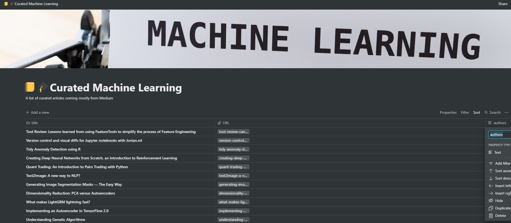

# medium-to-notion
 
* Get url for every item in Medium's Reading list 
* Parse and save urls from above 
* Push parsed files to Notion and create a collection 
 
The end result should look like this ...

